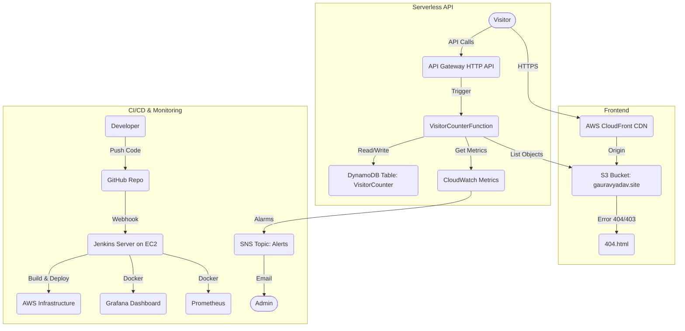

# 01. Cloud Resume Challenge Architecture

## 1. High-Level Overview
This project is a **serverless, event-driven web application** hosted on AWS. It adheres to modern DevOps principles including Infrastructure as Code (IaC), CI/CD, and Observability.

### Architecture Diagram

## 2. Core Components

### A. Frontend (Static Site)
*   **Technology**: HTML5, CSS3 (Glassmorphism), Vanilla JS.
*   **Hosting**: AWS S3 (Static Website Hosting).
*   **Delivery**: AWS CloudFront (CDN) for global low latency and HTTPS termination.
*   **Domain**: `gauravyadav.site` (Managed via Route53 & ACM).

### B. Backend (API)
*   **Compute**: AWS Lambda (Python 3.9).
*   **Database**: Amazon DynamoDB (NoSQL).
    *   *Table*: `VisitorCounter` (Partition Key: `id`).
*   **API**: AWS API Gateway (HTTP API).
    *   `POST /visitor`: Increments view count.
    *   `GET /gallery`: Lists photos from S3.
    *   `GET /metrics`: Fetches CloudWatch stats.

### C. Infrastructure (IaC)
*   **Tool**: Terraform (v1.x).
*   **State**: Remote Backend (S3 Bucket `gyadav-terraform-state-backend`).
*   **Modules**:
    *   `main.tf`: Core AWS resources (S3, Lambda, API, DB).
    *   `jenkins.tf`: CI/CD Server (EC2, SG, IAM).
    *   `monitoring.tf`: Dashboards.
    *   `alerts.tf`: Alarms & SNS.

### D. Observability
*   **Logging**: CloudWatch Logs (7-day retention).
*   **Metrics**: CloudWatch Metrics (Lambda Duration, Errors, Invocations).
*   **Visualization**:
    1.  **Public**: `status.html` (Chart.js via Lambda Proxy).
    2.  **Private**: Grafana (`http://<JENKINS_IP>:3000`) + Prometheus.
*   **Alerting**: CloudWatch Alarms -> SNS -> Email.

## 3. Security Design
1.  **Least Privilege**: Lambda IAM role has only `dynamodb:UpdateItem`, `s3:ListBucket`, and `cloudwatch:GetMetricStatistics`.
2.  **Secrets Management**: Jenkins keys are stored in AWS Secrets Manager, not Git.
3.  **Network**:
    *   Frontend is HTTPS-only.
    *   API Gateway uses CORS to restrict access.
    *   Jenkins Security Group allows SSH (22) and Grafana (3000).

## 4. Cost Optimization
*   **Serverless**: Lambda/DynamoDB are pay-per-use (Free Tier eligible).
*   **Logs**: Retention capped at 7 days.
*   **EC2**: `t2.micro` (Free Tier).
*   **CDN**: CloudFront Price Class 100 (NA/EU only).
